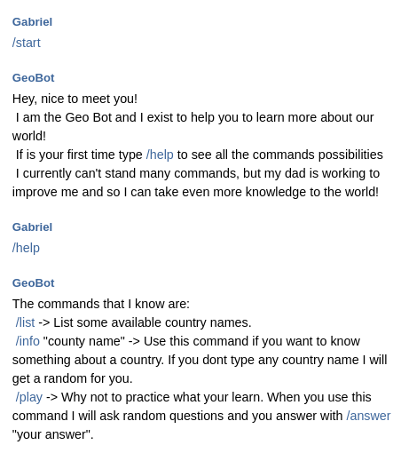
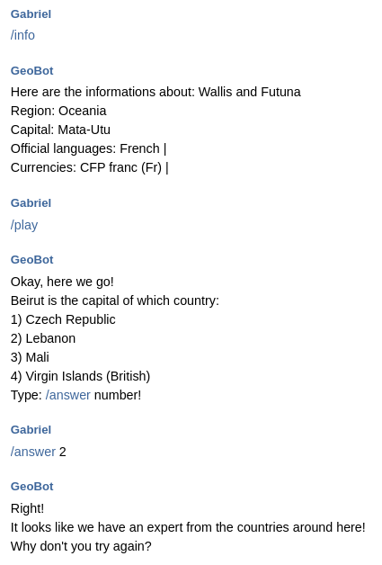

# GEO BOT (EducationalGeoBot)

GeoBot was developed in order to assist in the dissemination of geographic knowledge. Using simple commands the bot is able to provide some information about all countries in the world. In addition, GeoBot is capable of doing a small quiz with the user!

## HOW TO USE

* Compile the code by yourself using: `go build -o GeoBot && ./GeoBot`.
* Using the `Makefile` available. In this case, use the command: `make` (Don't forget to use `make clean`).

## EXAMPLES

    </img> 
    </img>

## ATTENTION

* **Obviously the access TOKEN has been removed and, therefore, the code has only the educational character (for those who want an example) and/or are learning Go.**
* This code makes use of the [REST Countries](https://restcountries.eu/) API.
* The code also uses the [go-telegram-bot-api](https://github.com/go-telegram-bot-api/telegram-bot-api) dependency.
* Feel free to use the code and change it as you wish.